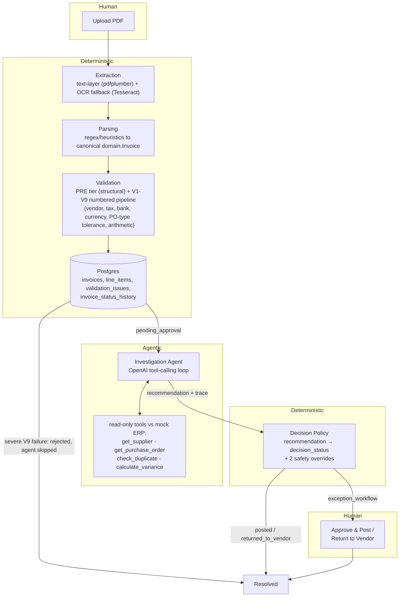

# Intelligent Invoice Processing

## Overview

A vertical-slice prototype of an enterprise accounts-payable invoice processing system: PDF invoice in, a posted-or-flagged decision out, with a full audit trail at every step. The interesting part isn't the extraction — it's what happens after: a tool-calling LLM agent investigates each invoice against mock ERP data (supplier status, purchase orders, duplicates), a deterministic policy layer converts its recommendation into a real business decision, and a human can act on it through controlled, permission-gated write actions. This is agentic business logic, not a PDF-to-JSON demo.

## Live Demo

**[Try it live](https://ca-invproc-demo.whitehill-b7082afb.centralus.azurecontainerapps.io/ui/)** — deployed on Azure Container Apps + PostgreSQL Flexible Server, demo-tier (scale-to-zero), so the first request after a period of idle may take a few seconds to cold-start.

The app is login-gated (role-based access: AP clerk vs. manager). Use one of these fixed demo accounts:

| Username  | Password             | Role       | Can do                                                              |
|-----------|-----------------------|------------|----------------------------------------------------------------------|
| `clerk`   | `clerk-demo-pass`     | AP Clerk   | Upload/view invoices, see extraction, validation, and agent trace   |
| `manager` | `manager-demo-pass`   | Manager    | Everything a clerk can, plus Approve & Post / Return to Vendor, plus the Analytics page |

These are fixed, publicly-known demo credentials for this prototype — not meant to represent real account security.

[`/health`](https://ca-invproc-demo.whitehill-b7082afb.centralus.azurecontainerapps.io/health) · [`/docs`](https://ca-invproc-demo.whitehill-b7082afb.centralus.azurecontainerapps.io/docs)

## Architecture



`Extraction` is labeled Deterministic on the primary text-layer path; the OCR fallback is AI-assisted (a fixed-output ML model, not a reasoning step) but still not agentic — it never makes a judgment call. Every invoice's `decision_status` moves through a full lifecycle -- `received → validated → pending_approval → exception_workflow → posted / rejected / returned_to_vendor` -- and every transition is logged to `invoice_status_history`, not just the resting value on the invoice row. Every arrow into Postgres is append-only where it represents a decision: `agent_investigations`, `invoice_decisions`, `invoice_actions`, and `invoice_status_history` are four separate, ever-growing audit tables, not rows that get overwritten.

## Design decisions worth defending

- **Domain model ≠ API schema.** `domain.Invoice` is the canonical business object that flows through extraction → validation; API response schemas (`InvoiceOut`, `InvestigationOut`, ...) are a separate, independently-evolving contract. `decision_status` deliberately lives *outside* `domain.Invoice` — it's workflow state (who's supposed to act next), not invoice data, and conflating the two would make the core model harder to reason about as the workflow grows.
- **Extraction and parsing are 100% deterministic — no LLM.** Text-layer extraction and regex-based field parsing are reproducible, unit-testable without hitting an API, and cheap. An LLM would handle messier layouts better, but a first vertical slice needs the guarantees determinism buys, not maximum flexibility.
- **Validation is a numbered, context-threaded pipeline, not a flat rule list.** An unnumbered `PRE` tier handles structural well-formedness (line items present, date sanity) since those aren't business-validation steps; the numbered `V1`-`V9` sequence (vendor identification through arithmetic/total) shares a single `ValidationContext` so, e.g., `V4` company-code determination can read the PO that `V1` already resolved instead of re-querying it. A severe `V9` arithmetic failure short-circuits the whole pipeline straight to `rejected`, skipping the agent investigation entirely — there's nothing for an LLM to usefully judge when the invoice's own numbers don't reconcile, and it saves the API call.
- **Three-way-match tolerance is PO-type-specific, not a flat percentage.** `goods`/`services`/`indirect` purchase orders each get their own configured variance tolerance (tightest for goods, loosest for services) because a single flat threshold doesn't reflect how precise/countable vs. estimated those categories really are. `calculate_variance` resolves the PO and its type server-side rather than trusting the agent to relay a `po_amount` it read off a tool result.
- **The agent is a hand-rolled tool-calling loop, not a framework.** Full control over the permission boundary (`TOOL_REGISTRY`/`dispatch_tool`), termination semantics (max-turns, timeout), and exactly what's in every message — no framework abstraction between "what the model saw" and "what we can audit."
- **"Agent proposes, deterministic code disposes."** The model's `recommendation` never directly sets `decision_status` — it goes through `policy.decide()` plus two explicit override checks (`_apply_policy_overrides` in `agent/runner.py`): a missing PO reference forces `human_review` even if the model tried `auto_approve`, and a blocked supplier forces `human_review` even if the model tried `auto_approve` *or* `return_to_vendor`. Neither is hypothetical — the no-PO-reference override caught the model auto-approving an invoice despite the prompt saying not to, and the blocked-supplier override was added after an eval run showed the model resolving a blocked-supplier case straight to `return_to_vendor` on its own, bypassing human review for what's typically a compliance/legal hold, not a vendor-side invoice defect. Business-critical state transitions don't get to depend on the model reliably following instructions.
- **Append-only audit tables everywhere.** `agent_investigations`, `invoice_decisions`, `invoice_actions`, and `invoice_status_history` are never updated in place. An AP system needs to answer "who decided this, and why" long after the fact, including across re-investigations of the same invoice and every lifecycle transition an invoice passed through, even the ones a synchronous pipeline blows through within a single request.
- **Read/write tool permissions are enforced in code, not convention.** Before any write tool existed, "the agent can only read" was true only because nothing else was defined. `TOOL_REGISTRY` tags every tool `READ`/`WRITE`; `dispatch_tool()` checks the caller's `allowed_permissions` before executing anything. When `post_invoice`/`return_to_vendor` were added, the investigating agent's default permission set (`{READ}`) meant it literally cannot call them — proven, not assumed.
- **Synchronous request + client-side reveal, not WebSockets.** An investigation takes 5–20 seconds. Returning the full trace in one response and replaying it client-side with a staggered delay gets most of the "live" feel with none of the cost of a background task runner, incremental persistence, or connection lifecycle management — consistent with keeping infra minimal per slice.

## What's built

1. **Deterministic pipeline** — PDF → extraction (text-layer + OCR) → parsing → canonical `Invoice` → a `PRE` + `V1`-`V9` numbered validation pipeline (vendor identification, vendor status, field cross-validation, company code, duplicate check, bank validation, currency/rate, tax determination, arithmetic/total) with PO-type-specific (`goods`/`services`/`indirect`) three-way-match tolerance → Postgres.
2. **Tool-calling investigation agent** — OpenAI function-calling loop against 4 read-only tools and mock ERP data (suppliers, purchase orders).
3. **Full decision lifecycle + minimal demo UI** — `received → validated → pending_approval → exception_workflow → posted / rejected / returned_to_vendor`, policy-driven with two deterministic safety overrides (missing PO reference, blocked supplier) backstopping the model, a severe arithmetic failure short-circuiting straight to `rejected` without an agent call, an append-only `invoice_status_history` audit trail, and a single-page frontend with a live-feeling trace reveal.
4. **Automated evaluation suite** — 10 fixed cases spanning the disposition-policy boundary, safety-asymmetric grading.
5. **Observability + guardrail hardening** — token/latency metrics, an explicit tool permission registry, distinct max-turns/timeout visibility.
6. **Human-in-the-loop write actions** — `post_invoice`/`return_to_vendor` as permission-gated WRITE tools, executable only by a human on an invoice in `exception_workflow`, full audit trail.

## Real bugs found & fixed

Not hidden — this is what happened while actually exercising the system, not just writing it.

- **`UniqueConstraint` contradiction.** A DB-level unique constraint on `(vendor_name, invoice_number)` silently blocked the documented "persist duplicates, flag them" design. Never caught because the Postgres integration tests always skipped until Docker was installed mid-project. Fixed by dropping the constraint.
- **Test fixture wiping the dev database.** An integration test fixture's `Base.metadata.create_all`/`drop_all` ran against the same persistent Postgres instance used for manual testing, silently deleting real data. Fixed by removing schema management from tests entirely — that's Alembic's job.
- **PO-number guessing.** The agent would guess PO numbers not present in the invoice's raw text — including, once, reusing a real PO number from a *different* invoice and getting a spurious match. Fixed with two layers: a prompt/schema instruction, and a deterministic tool-level check rejecting any `po_number` argument that isn't a literal substring of the raw extracted text.
- **Missing concern-tag vocabulary** (`SUPPLIER_BLOCKED`, `DETERMINISTIC_VALIDATION_FAILED`). The model had no tag for "supplier found but blocked" or "pre-existing deterministic validation issue," so it reached for the nearest wrong one (`UNKNOWN_SUPPLIER`, `PO_AMOUNT_MISMATCH`) instead. Fixed by adding the missing tags and tightening the existing ones' definitions to an explicit tag → tool-result mapping.

## Eval results

`evals/` runs 10 fixed invoices through the real pipeline → agent → decision stack — one case per edge of the documented disposition policy (clean approve, unknown/blocked supplier, PO mismatch, duplicate, missing PO reference, cancelled/closed PO, borderline variance on both sides of the tolerance threshold).

Grading is **safety-asymmetric**, not strict pass/fail:

| Grade | Meaning |
|---|---|
| `PASS` | Exact match with the expected recommendation |
| `SOFT-FAIL` | Model was *more cautious* than expected — safe, just imprecise |
| `FAIL` | Model was *more permissive* than expected — the dangerous direction (auto-approving something that should've been caught) |

Two accuracy numbers are reported: **strict accuracy** and **safe-outcome rate** (`PASS` + `SOFT-FAIL`) — the second is arguably the one that matters for a deployment gate.

Latest run (`gpt-4o-mini`):

```
Strict accuracy:   9/10 (90.0%)
Safe-outcome rate: 10/10 (100.0%)
Avg tool calls:    4.5
Avg tokens:        6575.6 (prompt: 6415.5, completion: 160.1)
```

The one strict miss, `po_closed` (expected `return_to_vendor`, got `human_review`), is a documented, non-regressive case of sampling variance, not a bug: it's the only case stacking three concerns at once (closed PO + missing supplier bank details + a tax-rate mismatch), which is genuinely borderline for the model to resolve consistently — see the comment on that case in `evals/cases.py`. It never flips to `auto_approve` (the dangerous direction), which is why safe-outcome rate stays 10/10 regardless. Worth revisiting only if this kind of flip starts happening on an isolated, single-concern case — that would point to a real prompt/policy gap rather than ordinary variance.

```bash
poetry run evaluate-agent   # console report + JSON artifact under evals/results/
```

## How to run locally

**Prerequisites**: Python 3.11, [Poetry](https://python-poetry.org/) 2.x, Docker, an OpenAI API key. For OCR: `brew install tesseract poppler`.

```bash
poetry install
cp .env.example .env          # then fill in OPENAI_API_KEY

docker compose up -d           # Postgres
poetry run alembic upgrade head
poetry run seed-mock-erp       # seeds suppliers + purchase orders

poetry run uvicorn invoice_processing.main:app --reload
```

Open **http://localhost:8000/ui/** for the demo page, or use the API directly (`POST /invoices`, `POST /invoices/{id}/investigate`, `POST /invoices/{id}/decisions/{decision_id}/execute`, ...).

Other entry points:

```bash
poetry run process-invoice path/to/invoice.pdf   # process one PDF via the CLI, no API
poetry run evaluate-agent                          # run the eval suite
poetry run pytest                                    # 104 tests (unit + integration)
```

Integration tests that need Postgres or a live OpenAI call skip automatically if the DB isn't reachable or `OPENAI_API_KEY` isn't set.

## Roadmap

*Azure deployment is done, not just planned* — Container Apps + PostgreSQL Flexible Server, one resource group, deployed via imperative `az` CLI (no Terraform/Bicep yet). See [Live Demo](#live-demo) above.

- **Kafka / event backbone** — decouple investigation from the synchronous upload request; enable async processing at a throughput beyond one FastAPI request cycle.
- **Multi-agent split** — separate the investigation agent from a distinct approval/routing agent, so write-capable roles are structurally isolated, not just permission-flagged within one agent.
- **AWS deployment** — containerize, move Postgres to RDS, S3 for source PDFs, real secrets management in place of `.env`.
- **Real ERP integration** — replace `erp_mock/` with a live supplier/PO source; the read-only tool interface was designed to make this a data-layer swap, not a rewrite.
- **SAP BTP mapping** — evaluate this architecture's agent/tool/decision layers against SAP's Business Technology Platform integration and workflow services for an enterprise deployment target.
